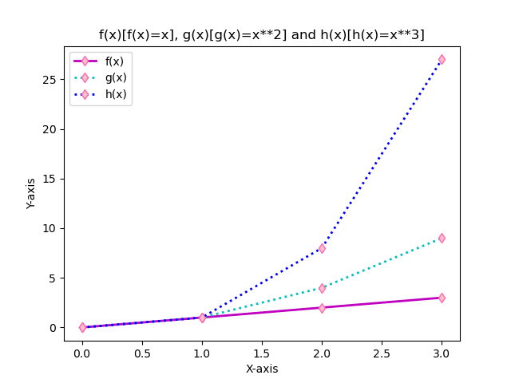

# pands-problem-sheet

___

# PANDS 2021 Problem Sheet for Weekly Tasks 

## Betty Attwood G00398300 January - April 2021

# Introduction

___

This ReadMe explains how the code used to complete the weekly tasks for GMIT's Programming and Scripting module works and provides references. This assignment is part of the work done  to complete GMIT's Computer Science Data Analytics postgraduate degree. 

# Task 1:

___

### Task Description:
Please copy a link to your repository here (only the URL).

### Code:
Task 1 did not involve any code. Repository was created and file pushed. The url to my repository was submitted as https://github.com/BettyAtt/myWork

### Explaining the Code:
No coding for this task.

### References:
No references for this task.

# Task 2:
___

### Task Description:
Write a program that calculates somebody's Body Mass Index (BMI). Call the file bmi.py

The inputs are the person's height in centimetres and weight in kilograms.
The output  is their weight divided by their height in metres squared.

>$ python bmi.py  
>Enter weight: 65  
>Enter height: 180  
>BMI is 20.06  


### Code:
    height = float (input ('Enter your height in cm: '))
    weight = float (input ('Enter your weight in kg: '))
    metersquared = (height/100)**2
    BMI = round(weight / metersquared, 2)
    print('Your BMI is {}'.format(BMI))

### Explaining the Code:
1. The user is prompted to enter height and weight as a float. 
2. The entered weight is divided by the entered height in meters to the power of two.
3. The output is printed. The code `.format(BMI)` fills in the placeholder `{}`with the BMI variable which calculates the BMI using the formula utilising the users inputs.

### References:
1. w3schools.com. 2020. *Python String format() Method*. [online] Available at: https://www.w3schools.com/python/ref_string_format.asp [Accessed 31 January 2021].
2. Vanderplas, J., n.d. 2016. *A Whirlwind Tour Of Python*. O'Reilly Media Inc. Available at: https://www.oreilly.com/programming/free/files/a-whirlwind-tour-of-python.pdf [Accessed 31 January 2021].
3. Tintumon, M., M, K., Visser, S. and Nath, A., 2021. *BMI Calculator In Python*. [online] Stack Overflow. Available at: https://stackoverflow.com/questions/20405610/bmi-calculator-in-python/20405792 [Accessed 31 January 2021].
4. Diabetes Canada. 2021. *How to Calculate Body Mass Index*. Available at: https://www.diabetes.ca/managing-my-diabetes/tools---resources/body-mass-index-(bmi)-calculator#:~:text=Body%20Mass%20Index%20is%20a,range%20is%2018.5%20to%2024.9. [Accessed 31 January 2021].

# Task 3:

___

### Task Description:
Write a program that asks a user to input a string and outputs every second letter in reverse order.

>$ python secondstring.py  
>Please enter a sentence: The quick brown fox jumps over the lazy dog.  
>.o zletrv pu o wr cu h  

### Code:
    rawString = input("please enter a sentence:")
    print(rawString[::-2])

### Explaining the Code:
1. The user is asked to enter a sentence (string).
2. The code counts the length of string and outputs every second letter in reverse order.  

Example: 

- Please enter a sentence: The quick brown fox jumps over the 
lazy dog.
- Output: .o zletrv pu o wr cu h

3. The syntax is `s[start:stop:step]` When the start position is left blank the default start position is 0. When the stop position is left blank the default is the length of the string.
4. The string order is reversed by use of a negative in the step position. The code `:-2`selects every other character beginning at the end of the string and prints out these characters.

### References:
1. Vanderplas, J., n.d. 2016. *A Whirlwind Tour Of Python*. O'Reilly Media Inc., List Indexing and Splicing, p.32-34. Available at: https://www.oreilly.com/programming/free/files/a-whirlwind-tour-of-python.pdf [Accessed 7 February 2021].
2. Pankaj. 2019. *Python Slice String* in *JournalDev* Available from: https://www.journaldev.com/23584/python-slice-string#:~:text=The%20slicing%20starts%20with%20the,for%20any%20index%20 [Accessed 7 February 2021]
3. Learn by Example. 2019. *Python String Slicing* Available from: https://www.learnbyexample.org/python-string-slicing/ [Accessed 7 February 2021]
4. w3schools.com. 2021. *Python - Slicing Strings*. Available at: https://www.w3schools.com/python/python_strings_slicing.asp  [Accessed 7 February 2021].

# Task 4:

___

### Task Description:
Write a program that asks the user to input any positive integer and outputs the successive values of the following calculation.  

At each step calculate the next value by taking the current value and, if it is even, divide it by two, but if it is odd, multiply it by three and add one.  

Have the program end if the current value is one.  

>$ python collatz.py  
>Please enter a positive integer: 10  
>10 5 16 8 4 2 1  

### Code:
    collat = int(input("enter a positive integer: "))
    while collat <= 0:
        print("Error!")
        collat = int(input("enter a positive integer: "))

    collatz = [] 
    collatz.append(int(collat)) 

    while collat != 1:
        if collat % 2 == 0:
           collat = collat / 2 
        elif:
            collat = ((collat * 3) + 1)
        collatz.append(int(collat))

    print(collatz)

### Explaining the Code:
1. The user is asked to input a positive number. A while loop is used to prevent the user from inputting a negative number. If a number less than zero is enter "Error!" is printed and user is asked to input a positive integer again.
2. The inputted number is appended to the array `collatz = []` 
3. Another while loop is used to direct the actions as long as the number is not 1. While the number is not 1: If the number is positive (calculated by `if collat % 2 == 0:`) then the number is divided by 2. If the number is not even, the else loop kicks in `collat = ((collat * 3) + 1)` and the number is multiplied by three then 1 is added to it. The results of each calculation is added to the array by the code `collatz.append(int(collat))` at the end of the while loop. 4. The numbers appended to the array are printed `print(collatz)`.

### References:
1. w3schools.com 2021. *Python While Loops* Available at:https://www.w3schools.com/python/python_while_loops.asp [Accessed 14 February 2021].
2. w3schools.com 2021. *Ref List Append* Available at: https://www.w3schools.com/python/ref_list_append.asp [Accessed 14 February 2021].
3. Vanderplas, J., n.d. 2016. *A Whirlwind Tour Of Python*. O'Reilly Media Inc., While loops, p.39-45. Available at: https://www.oreilly.com/programming/free/files/a-whirlwind-tour-of-python.pdf [Accessed 14 February 2021].
4. w3resource.com 2020. *Python Challenges: 3n + 1 Problem*. Available at: https://www.w3resource.com/python-exercises/challenges/1/python-challenges-1-exercise-23.php [Accessed 14 February 2021].

# Task 5:

___

### Task Description:
Write a program that outputs whether or not today is a weekday.  

(You will need to search the web to find how you work out what day it is)  

An example of running this program on a Thursday is given below.  

>$ python weekday.py  
>Yes, unfortunately today is a weekday.  

>An example of running it on a Saturday is as follows:  
>$ python weekday.py  
>It is the weekend, yay!  

### Code:
    import datetime

    today = datetime.date.today()
    print("Today is ", today.strftime("%A"))

    weekDay = datetime.datetime.today().isoweekday()
    if weekDay < 6:
        print("Yes, unfortunately, today is a weekday.")
    else:
        print("It is the weekend, yay!")

### Explaining the Code:
1. Firstly, the python module datetime is imported.
2. The code `today = datetime.date.today()` returns the date time object for the specified time today which returns time at current location.
3. The variable weekDay returns the days of the weeks assigned integer values. The code `.isoweekday()` assigns Monday the value of 1, Tuesday the value of 2, etc. 
4. This means we can use Python's built in logic such as greater than and less than to determine whether the current date is a week day or weekend. The code uses the code `if weekDay < 6` and `else:` to print out the appropriate responses. 

### References:
1. Sweigart, A. 2015. Chapter 15 Keeping Time in *Automate the Boring Stuff with Python*. San Francisco: No Starch Press, pp.341-146. 
2. Python Docs. 2021. *Datetime Module*. Available at: https://docs.python.org/3/library/datetime.html. [Accessed 06 April 2021]. 
3. w3schools.com 2020. *Python Dates*. Available at: https://www.w3schools.com/python/python_datetime.asp. [Accessed 21 February 2021].

# Task 6:

___

### Task Description:
Write a program that takes a positive floating-point number as input and outputs an approximation of its square root.

You should create a function called <tt>sqrt</tt> that does this.

I am asking you to create your own sqrt function and not to use the built in functions x ** .5 or math.sqrt(x).

This is to demonstrate that you can research and code a process (If you really needed the square root you would use one of the above methods).

I suggest that you look at the newton method at estimating square roots.

>$ python squareroot.py  
>Please enter a positive number: 14.5  
>The square root of 14.5 is approx. 3.8.  

### Code:
    def NewtonMethod_sqrt(number, number_iters = 5):
        a = float(number) # number program gets square root of
        for i in range(number_iters):
            number = 0.5 * (number + a / number)
        # Medium reference: x_(n+1) = 0.5 * (x_n +a / x_n)
        return number

    n = float(input("Enter a positive number: "))
    if n < 0:
        print("Please enter a positive number")

    else:
        answer = (NewtonMethod_sqrt(n))
        print("The approximate square root of {} is ".format(n) + str(round(answer,1)))

### Explaining the Code:
1. The function is defined using the Newton method, as suggested in task prompt. The code relating to this method is largely influenced by  Sıddık Açıl's code although other sources were consulted and the method for defining a function was influenced *A Whirlwind Guide to Python* and w3schools. This source was influential as many other sources were focused on the mathematical elements of the equations rather than the code.
2. The number of iterations were chosen as 5 as one-three iterations provide unreliable answers when I did several test runs of the program. E.g. One iteration of the square root of 14.5 results in 7.8. Two iterations results in 4.8. Three iterations results in 3.9, four iternations and above result in 3.8. A number over 5 did not seem to return more accurate results as my tests were not dealing with long floaing numbers. Further research would be needed to determine the best number of iterations to use.
3. The newton formula is then run with code: `number = 0.5 * (number + a / number)`. This is based off the Newton Method algebra: x_(n+1) = 0.5 * (x_n +a / x_n) [see Açıl]. And the number is returned. 
4. Now that Newton's method is defined, code is written asking for the user to input a positive integer: `n = float(input("Enter a positive number: "))`.
5. To prevent a user from entering a negative integer, the following if condition is used:  
 `if n < 0:
    print("Please enter a positive number")`  
6. Else is used to prompted the program to take the positive integar input and run the aboved defined Newton Method of calculating square root.
7. The program prints out answer formatted as a string which contains the original input and the answer rounded to one decimal place.
8. Example input and output:  
    - Input: 15.3
    - Output: 3.9


### References:
1.  Açıl, Sıddık. *Newton Square Root Method in Python*. Available at: https://medium.com/@sddkal/newton-square-root-method-in-python-270853e9185d [Accessed March 14, 2021].
2. Sweigart, A. 2015. Chapter 3: Functions in *Automate the Boring Stuff with Python*.  San Francisco: No Starch Press, pp.61-79. 
3. Vanderplas, J., n.d. 2016. *A Whirlwind Tour Of Python*. O'Reilly Media Inc., While loops, p.39-45. Available at: https://www.oreilly.com/programming/free/files/a-whirlwind-tour-of-python.pdf [Accessed 14 February 2021].
4. Kurtus, Ron. 2012. The School for Champions. *Newton's Square Root Approximation*. Available at: https://www.school-for-champions.com/algebra/square_root_approx.htm#.YGwVBK9KjIW [Accessed: March 21, 2021].
5. w3schools.com. 2021. *Python Functions.* Available at: https://www.w3schools.com/python/python_functions.asp [Date Accessed: 21 March 2021].

# Task 7:

___

### Task Description:
Write a program that reads in a text file and outputs the number of e's it contains.

The program should take the filename from an argument on the command line.

>$ python es.py moby-dick.txt  
>116960  

### Code:
    txtfile = str(input("Insert .txt File Name: "))

    with open (txtfile, "r") as f:
        data = f.read()
        freq = data.count("e") 
        freq2 = data.count("E") 
        combo=int(freq + freq2) 
        print("The combined number of uppercase and lowercase e's in Moby Dick: ", combo)

### Explaining the Code:
1. This program reads in a file MobyDick.txt and outputs the combined numbers of lower and upper case e's. For this task, I utilised The Gutenberg Press Etext of Moby Dick
by Herman Melville. The text analysed began at Chapter 1  and the epilogue was included. No preface material or title page was included in calculations. 
2. The user is asked to input the name of the txt file as string.
3. The text file is opened using the `with open` method of opening files in Python which automatically closes them when the program completes its run. The function returns the file in read mode `(txtfile, "r") as f` and refers to the txtfile as f.
4.  The variable data is defined as reading the specified file.
5. The python string count() method returns the number of occurences of the specified substring 'e' in the given string 'data' as freq. This is then repeated with "E" as freq2.
6. These two counts are added together to get the combined number of times "e" and "E" occurances in the txt file and formatted as int. The problem did not specify whether to solve just for lowercase or uppercase, so a combination method was chosen and the individual counts for upper and lower case can easily be isolated.
7. This variable combo is printed out with a string explaining the significance of the number.
8. In an early iternation I double checked the outputs for 'e' is 114114, and 'E' is 906 . The combined answer that prints out for my example txt document moby-dick.txt is 115020. 


### References:
1. Melville, Herman. *Moby Dick [Etext]*. The Gutenberg Press. Available at: https://www.gutenberg.org/files/2701/old/moby10b.txt . [Date Accessed: 24 March 2021].
2. Programiz.com. 2021. *Python String Count ()* Available at: https://www.programiz.com/python-programming/methods/string/count [Date Accessed: 25 March 2021].
3. w3schools.com. 2021. *Python String count() Method.* Available at : https://www.w3schools.com/python/ref_string_count.asp [Date Accessed: 24 March 2021].
4. McKinney, T and Jsbueno. Stackoverflow.com. *How many times a substring occurs.* Available at: https://stackoverflow.com/questions/8899905/how-many-times-a-substring-occurs [Date Accessed: 25 March 2021].
4. Pythonexamples.org. 2020. *How To Count Number Of Characters In Text File? – 2 Python Examples.* [online] Available at: https://pythonexamples.org/python-count-number-of-characters-in-text-file/ [Accessed 29 March 2020].

# Task 8:

___

### Task Description:
Write a program called plottask.py that displays a plot of the functions f(x)=x, g(x)=x2 and h(x)=x3 in the range [0, 4] on the one set of axes.

Some marks will be given for making the plot look nice.

### Code:
    import numpy as np
    import matplotlib.pyplot as plt

    # x-axis values:
    x=np.arange(0.0,4.0,1.0) #range of 1-4; steps of 1
    # y-axis values:
    y1 = x     # f(x)
    y2 = x**2  # g(x)
    y3 = x**3  # h(x)

    #plotting the points
    plt.plot(y1, 'd-m', lw = 2, ms = 6, mec = 'hotpink', mfc = 'pink', label='f(x)')
    plt.plot(y2, 'd:c', lw = 2, ms = 6, mec = 'hotpink', mfc = 'pink', label='g(x)')
    plt.plot(y3, 'd:b', lw = 2, ms = 6, mec = 'hotpink', mfc = 'pink', label='h(x)')
    # above plots the point, and sets line color, line type, linewidth, the marker 
    # The label adds the name of the line and works in conjunction with the following code:

    plt.title('f(x)[f(x)=x], g(x)[g(x)=x**2] and h(x)[h(x)=x**3]') # adds the plot title
    plt.xlabel('X-axis') # names x-axis
    plt.ylabel('Y-axis') # names y-axis


    plt.legend() # displays labels in plots above
    plt.show() # Depicts graphic representation of the plot


### Explaining the Code:
1. Matplotlib and NumPy are imported. "Matplotlib is a plotting library for Python. It is used along with NumPy to provide an environment that is an effective open source alternative for MatLab" (tutorialspoint).
2. The x axis values are defined by code: `x=np.arange(0.0,4.0,1.0)`.  
The syntax is:  
> numpy.arange([start, ]stop, [step, ], dtype=None)  

Start is the first value in the array, in this case 0.0; Stop defines the end of the array and isn't a part of the array. Step is the spacing between two consecutive values in the array and the default is 1. dtype is the type of elements in the output of the array, the default is none if not specified as in my code (see Stojiljković).
3. The y coordinates are determined as per the function given to plot: f(x)=x, g(x)=x<sup>2</sup> and h(x)=x<sup>3</sup>. Broken down into the three y axis plot points:   
```
y1 = x     which represents f(x)  
y2 = x**2  which represents  g(x)  
y3 = x**3  which represents  h(x)
```
4. Next `plt.plot(y1, ...` is used to direct the program to plot each of the points. Within the brackets are customisable features such as colour, line with, line type, marker type, color, fill, etc. I used the fmt shortcut string notations to specify the marker which uses abbrevations to denote the marker-line-color `'d-m'`, but then specify more details such as line width `lw` , marker size `ms`, marker edge color `mec`, market fill color `mfc` and finally add a label. Customisation options were found at w3schools.
5. I then added the plot title,  `plt.title()`, as well as axis labels, e.g. `plt.xlabel()`
6.  The code then creates a legend `plt.legend()` which displays labels.
7. Finally the code `plt.show()` depicts graphic representation of the plot causing the graph to pop up when the program runs. As shown below:
 

### References:
1. TutorialsPoint.com. 2021. *NumPy - Matplotlib.* Available at: https://www.tutorialspoint.com/numpy/numpy_matplotlib.htm [Accessed 30 March 2020]
2.  Stojiljković, Mirko. RealPython. 2021 *NumPy arange(): How to Use np.arange()* Available at: https://realpython.com/how-to-use-numpy-arange/ [Accessed 30 March 2020].
3. w3schools.com 2021. *Matplotlib Markers* Available at: https://www.w3schools.com/python/matplotlib_markers.asp [Accessed 30 March 2020].
4. w3schools.com 2021. *Matplotlib Plotting* Available at: https://www.w3schools.com/python/matplotlib_pyplot.asp [Accessed 30 March 2020]
5. GeeksforGeeks.org *Graph Plotting in Python* Available at: https://www.geeksforgeeks.org/graph-plotting-in-python-set-1/ [Accessed 30 March 2020]
5. Solomon, Brad. Real Python. *Python Plotting With Matplotlib (Guide)* Available at: https://realpython.com/python-matplotlib-guide/ [Accessed 30 March 2020]
7. Stackoverflow.2013. *How to label a line in matplotlib (python)?* Available at: https://stackoverflow.com/questions/17941083/how-to-label-a-line-in-matplotlib-python/17942066 [Accessed 30 March 2020]
8. Matplotlib.org. 2021. *Pyplot tutorial* Available at: https://matplotlib.org/tutorials/introductory/pyplot.html [Accessed 30 March 2020]

